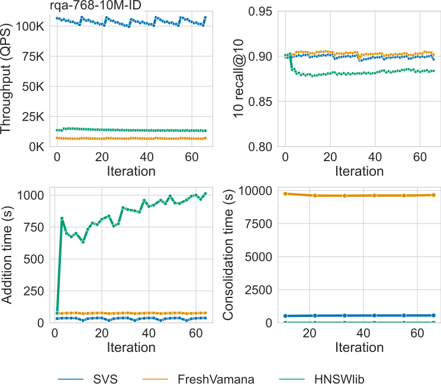

.. Copyright (C) 2024 Intel Corporation
..
.. This software and the related documents are Intel copyrighted materials,
.. and your use of them is governed by the express license under which they
.. were provided to you ("License"). Unless the License provides otherwise,
.. you may not use, modify, copy, publish, distribute, disclose or transmit
.. this software or the related documents without Intel's prior written
.. permission.
..
.. This software and the related documents are provided as is, with no
.. express or implied warranties, other than those that are expressly stated
.. in the License.

.. _benchs_streaming:

Benchmarks for Dynamic Indexing
###############################

This section presents the benchmarking results for dynamic indexing, that is, when the vectors in the database evolve
over time as new elements are added and existing elements are deleted.

We compare SVS to the state-of-the-art technique for streaming similarity search FreshVamana [SSKS21]_ and the widely
adopted HNSWlib [MaYa18]_ on various datasets covering a wide variety of practical scenarios, including different scales
(:math:`n=10^6` to :math:`n=10^8`), dimensionalities (:math:`d=96, 512, 768`), and deep learning modalities (texts,
images, and multimodal). A summary of the experimental setup is presented below, for more details see [AHBW24]_.

**Results summary:**

* **SVS outperforms its competitors in terms of QPS** by up to **9.4x** and **4.6x** for small (1M vectors) and large scale (over 10M vectors) datasets, respectively, for a search accuracy of 0.9 10 recall at 10.

* **SVS addition and delete-consolidation times** outclass the competition by up to **3.6x** and **17.7x**, respectively, for a search accuracy of 0.9 10 recall at 10 (see :ref:`note <streaming_metrics>` below about delete-consolidation times for HNSWlib).

* **SVS manges to keep a stable search recall over time**.

The figure below shows the different evaluated :ref:`metrics <streaming_metrics>` over time for the `rqa-768-10M <https://github.com/IntelLabs/VectorSearchDatasets/blob/main/rqa/README.md>`_
dataset (10M 768-dimensional embeddings generated with the dense passage retriever model RocketQA [QDLL21]_).
As explained in the :ref:`protocol <streaming_protocol>` below, at each iteration vectors are randomly deleted and added to the index.

|

|

**Click on the triangles** to see the results for the other datasets.

.. collapse:: deep-96-100M

    Results for the deep-96-100M dataset

    .. image:: ../figs/bench_iid_over_time_deep100M.svg
       :width: 500
       :alt: SVS streaming similarity search for the deep-96-100M dataset.

.. collapse:: open-images-512-13M

    Results for the open-images-512-13M dataset

    .. image:: ../figs/bench_iid_over_time_open-images-13M.svg
       :width: 500
       :alt: SVS streaming similarity search for the open-images-13M dataset.

.. collapse:: open-images-512-1M

    Results for the open-images-512-1M dataset

    .. image:: ../figs/bench_iid_over_time_open-images-1M.svg
       :width: 500
       :alt: SVS streaming similarity search for the open-images-1M dataset.

.. collapse:: rqa-768-1M

    Results for the rqa-768-1M dataset

    .. image:: ../figs/bench_iid_over_time_rqa-1M.svg
       :width: 500
       :alt: SVS streaming similarity search for the rqa-768-1M dataset.

|

.. _streaming_protocol:

Streaming Protocol
===================
The graph index is initialized with a random sample containing 70% of the dataset vectors. At each iteration, we delete
1% of the vectors in the index and add 1% of the vectors that are not indexed. The vectors to be added and deleted are chosen
at random. For the indices that perform delete consolitations, they are done every every 5 iterations. For more details see
[AHBW24]_.

Datasets
=========
To cover a wide range of use cases, we evaluate SVS on standard datasets of diverse dimensionalities (:math:`d=96`
to :math:`d=768`), number of elements (:math:`n=10^6` to :math:`n=10^8`), and metrics as described in the table below.

+--------------------------------------------------------------------------------------------------------------+-------+-------+--------------+-------------------+---------------+-----------------+
| **Dataset**                                                                                                  | **d** | **n** | **Encoding** | **Similarity**    | **n queries** | **Space (GiB)** |
+--------------------------------------------------------------------------------------------------------------+-------+-------+--------------+-------------------+---------------+-----------------+
| `deep-96-100M    <http://sites.skoltech.ru/compvision/noimi/>`_                                              | 96    | 100M  | float32      | cosine similarity | 10000         | 35.8            |
+--------------------------------------------------------------------------------------------------------------+-------+-------+--------------+-------------------+---------------+-----------------+
| `open-images-512-13M <https://github.com/IntelLabs/VectorSearchDatasets/blob/main/openimages/README.md>`_    | 512   | 13M   | float32      | cosine similarity | 10000         | 24.8            |
+--------------------------------------------------------------------------------------------------------------+-------+-------+--------------+-------------------+---------------+-----------------+
| `open-images-512-1M <https://github.com/IntelLabs/VectorSearchDatasets/blob/main/openimages/README.md>`_     | 512   | 1M    | float32      | cosine similarity | 10000         | 2.5             |
+-----------------------------------------------------------------------------------------------------+--------+-------+-------+--------------+-------------------+---------------+-----------------+
| `rqa-768-10M <https://github.com/IntelLabs/VectorSearchDatasets/blob/main/rqa/README.md>`_                   | 768   | 10M   | float32      | inner product     | 10000         | 28.6            |
+--------------------------------------------------------------------------------------------------------------+-------+-------+--------------+-------------------+---------------+-----------------+
| `rqa-768-1M <https://github.com/IntelLabs/VectorSearchDatasets/blob/main/rqa/README.md>`_                    | 768   | 1M    | float32      | inner product     | 10000         | 2.9             |
+--------------------------------------------------------------------------------------------------------------+-------+-------+--------------+-------------------+---------------+-----------------+

System Setup
============
We run our experiments on a 2-socket 3rd generation Intel\ |reg| Xeon\ |reg| Platinum 8360Y CPU @2.40GHz with
36 cores (single socket), equipped with 256GB DDR4 memory per socket @2933MT/s speed,  running Ubuntu 22.04. [#ft1]_ [#ft3]_

We use ``numactl`` to ran all experiments in a single socket (see :ref:`numa` for details).

We use the ``hugeadm`` Linux utility to :ref:`preallocate a sufficient number of 1GB huge pages <hugepages>` for each algorithm.
SVS explicitly uses huge pages to reduce the virtual memory overheads.
For a fair comparison, we run other methods with system flags enabled to automatically use huge pages for large allocations.
We run all methods with and without huge pages and report the best result.

Parameters Setting
==================
For SVS and FreshVamana, we use the following parameter setting for graph building: ``graph_max_degree`` = 64 and
``graph_max_degree`` = 128 for datasets with 1M and over 10M vectors, respectively; ``alpha`` = 1.2 and ``alpha`` = 0.95
for Euclidean distance and inner product, respectively; and a search window size for building of 200. For HNSWlib, we
use the same ``graph_max_degree`` setting as for the other methods (this corresponds to M = 32 and M = 64 in HNSW
parameter notation), and a search window size for building of 500.

.. _streaming_metrics:

Evaluation Metrics
==================
In all benchmarks and experimental results, search accuracy is measured by k-recall at k, defined by
:math:`| S \cap G_t | / k`, where :math:`S` are the ids of the :math:`k` retrieved neighbors and
:math:`G_t` is the ground-truth. We use :math:`k=10` in all experiments.
Search performance is measured by queries per second (QPS). We also report the time taken by the addition and delete
consolidations of vectors from the database.

HNSWlib supports delete requests by adding them to a blacklist and removing the deleted vectors from the retrieved
nearest neighbors. The slots in the delete list will be used for future vectors, but there is not a proper notion of
delete consolidation like the FreshVamana algorithm has. Therefore, the reported consolidation time is zero for HNSWlib.
This causes a search recall degradation over time for HNSWlib, as shown in the experimental results.
The time taken by deletions is not reported as it is negligible compared to the other tasks for all methods.

.. |copy|   unicode:: U+000A9 .. COPYRIGHT SIGN
.. |reg|   unicode:: U+00AE .. REGISTERED

.. rubric:: Footnotes

.. [#ft1] Performance varies by use, configuration and other factors. Learn more at `www.Intel.com/PerformanceIndex <www.Intel.com/PerformanceIndex/>`_.
       Performance results are based on testing as of dates shown in configurations and may not reflect all publicly
       available updates. No product or component can be absolutely secure. Your costs and results may vary. Intel
       technologies may require enabled hardware, software or service activation. |copy| Intel Corporation.  Intel,
       the Intel logo, and other Intel marks are trademarks of Intel Corporation or its subsidiaries.  Other names and
       brands may be claimed as the property of others.

.. [#ft3] All experimental results were completed by February 1st 2024.