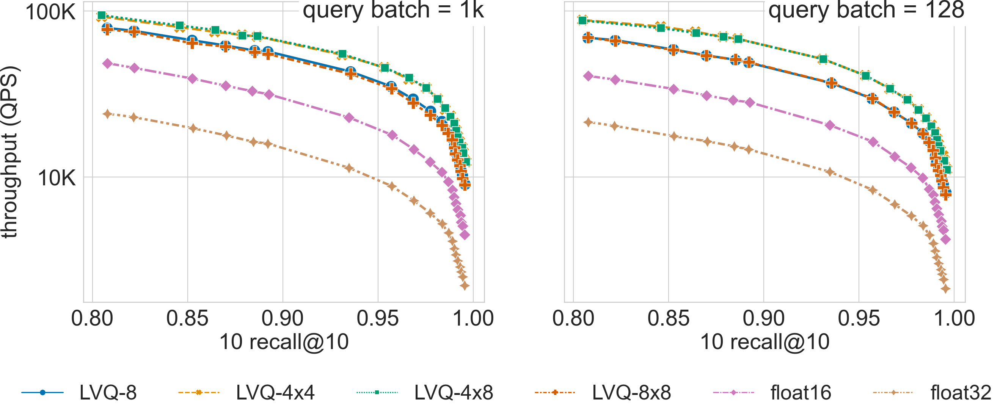

.. _small_scale_benchs:

Small Scale Benchmarks
**********************
We present here the results of an exhaustive evaluation, comparing SVS to other implementations in million scale datasets.

.. contents::
   :local:
   :depth: 1

System Setup and Datasets
=========================

We run our experiments on a 3rd generation Intel\ |reg| Xeon\ |reg| 8360Y CPU @2.40GHz with
36 cores (single socket), equipped with 256GB DDR4 memory per socket @2933MT/s speed,  running Ubuntu 22.04. [#ft1]_ [#ft3]_

We use ``numactl`` to ran all experiments in a single socket (see :ref:`numa` for details).

We consider datasets of diverse dimensionalities and number of vectors (see :ref:`datasets` for details):

* glove-25-1.2M (25 dimensions, 1 million points)
* glove-50-1.2M (50 dimensions, 1 million points)
* deep-96-10M (96 dimensions, 10 million points)
* sift-128-1M (128 dimensions, 1 million points)
* gist-960-1.0M (960 dimensions, 1 million points)

Comparison to Other Implementations
===================================

We compare SVS to five widely adopted approaches: Vamana [SDSK19]_, HSNWlib [MaYa18]_, FAISS-IVFPQfs [JoDJ19]_, ScaNN
[GSLG20]_, and NGT [IwMi18]_. We use the implementations available through `ANN-Benchmarks <https://github.com/erikbern/ann-benchmarks>`_
(`commit 167f129 <https://github.com/erikbern/ann-benchmarks/commit/167f1297b21789d13a9fa82646c522011df8c163>`_ , October 4th 2022)
and for SVS we use `commit ad821d8 <https://github.com/IntelLabs/ScalableVectorSearch/commit/ad821d8c94cb69a67c8744b98ee1c79d3e3a299c>`_.
See :ref:`param_setting_bench_small_scale` for details on the evaluated configurations for
each method. We run the evaluation in the three different :ref:`query modes <query_batch_size>`. [#ft2]_

Results summary:

* SVS **establishes a new SOTA** at very diverse scales (dataset dimensionality and number of points) revealing its
  versatility and suitability for contrasting use cases (see :ref:`results below <small_scale_results_all_datasets>`).

* The table below summarizes the QPS boost with respect to SVS closest competitor for a search accuracy
  of 0.9 10 recall at 10.

+-------------------+----------------------------------+----------------------------------+----------------------------------+
|                   | **Full query batch size**        | **Query batch size = 128**       | **Single query**                 |
+-------------------+-------------+--------------------+-------------+--------------------+-------------+--------------------+
|                   | **SVS QPS** | **QPS w.r.t. 2nd** | **SVS QPS** | **QPS w.r.t. 2nd** | **SVS QPS** | **QPS w.r.t. 2nd** |
+-------------------+-------------+--------------------+-------------+--------------------+-------------+--------------------+
| **deep-96-10M**   | 648122      | 5.49x              | 391739      | 6.28x              | 18440       | 1.92x              |
+-------------------+-------------+--------------------+-------------+--------------------+-------------+--------------------+
| **glove-25-1.2M** | 1224266     | 1.15x              | 711890      | 1.51x              | 34118       | 1.16x              |
+-------------------+-------------+--------------------+-------------+--------------------+-------------+--------------------+
| **glove-50-1.2M** | 558606      | 1.78x              | 376642      | 2.28x              | 17268       | 1.10x              |
+-------------------+-------------+--------------------+-------------+--------------------+-------------+--------------------+
| **gist-960-1.0M** | 56717       | 1.64x              | 62821       | 3.00x              | 1857        | 0.42x              |
+-------------------+-------------+--------------------+-------------+--------------------+-------------+--------------------+
| **sift-128-1M**   | 852705      | 1.84x              | 512785      | 2.15x              | 21969       | 0.95x              |
+-------------------+-------------+--------------------+-------------+--------------------+-------------+--------------------+

The full query batch is 10k queries for all datasets except for gist-960-1.0M which has a query set of size 1000 (see
:ref:`datasets` for details).

.. _small_scale_results_all_datasets:

**Click on the triangles** to see the throughput vs recall curves for each dataset.

.. collapse:: deep-96-10M

    Results for the deep-96-10M dataset

    .. collapse:: Batched queries

        .. image:: ../figs/bench_smallScale_batch_deep-image-96-angular.png
           :width: 800
           :alt: deep-96-10M benchmarking results (batch mode)

    .. collapse:: Single query

        .. image:: ../figs/bench_smallScale_single_deep-image-96-angular.png
           :width: 550
           :alt: deep-96-10M benchmarking results (single query)

    |

.. collapse:: glove-25-1.2M

    Results for the glove-25-1.2M dataset

    .. collapse:: Batched queries

        .. image:: ../figs/bench_smallScale_batch_glove-25-angular.png
           :width: 800
           :alt: glove-25-1.2M benchmarking results (batch mode)

    .. collapse:: Single query

        .. image:: ../figs/bench_smallScale_single_glove-25-angular.png
           :width: 550
           :alt: glove-25-1.2M benchmarking results (single query)

    |

.. collapse:: glove-50-1.2M

    Results for the glove-50-1.2M dataset

    .. collapse:: Batched queries

        .. image:: ../figs/bench_smallScale_batch_glove-50-angular.png
           :width: 800
           :alt: glove-50-1.2M benchmarking results (batch mode)

    .. collapse:: Single query

        .. image:: ../figs/bench_smallScale_single_glove-50-angular.png
           :width: 550
           :alt: glove-50-1.2M benchmarking results (single query)

    |

.. collapse:: gist-960-1.0M

    Results for the gist-960-1.0M dataset

    .. collapse:: Batched queries

        .. image:: ../figs/bench_smallScale_batch_gist-960-euclidean.png
           :width: 800
           :alt: gist-960-1.0M benchmarking results (batch mode)

    .. collapse:: Single query

        .. image:: ../figs/bench_smallScale_single_gist-960-euclidean.png
           :width: 550
           :alt: gist-960-1.0M benchmarking results (single query)

    |

.. collapse:: sift-128-1M

    Results for the sift-128-1M dataset

    .. collapse:: Batched queries

        .. image:: ../figs/bench_smallScale_batch_sift-128-euclidean.png
           :width: 800
           :alt: sift-128-1M benchmarking results (batch mode)

    .. collapse:: Single query

        .. image:: ../figs/bench_smallScale_single_sift-128-euclidean.png
           :width: 550
           :alt: sift-128-1M benchmarking results (single query)

    |

|

.. _param_setting_bench_small_scale:

Parameters Setting
-------------------
We adopt the standard ANN-benchmarks [AuBF20]_ protocol and generate Pareto curves of QPS vs. recall for the considered
methods and datasets. For the graph-based methods (HSNWlib, Vamana, SVS) we use the same ``graph_max_degree`` values (32, 64 and 128).
For IVFPQfs, ScaNN and NGT-qg we consider the provided `yaml configuration files <https://github.com/erikbern/ann-benchmarks/>`_.
For SVS, we include various LVQ settings (LVQ-8, LVQ-4x4, LVQ-4x8, and LVQ8x8) as well as float16 and float32 encodings.
LVQ-compressed vectors are padded to half cache lines (``padding`` = 32).

.. _benchs-compression-evaluation_small_scale:

SVS + Vector Compression
========================
Memory footprint reduction is often not relevant for small scale datasets as their overall memory requirements are easily
satisfied by most low-end servers. However, we show here that for high-dimensional datasets, the performance boost achieved
by LVQ makes it very relevant even for datasets with a few million points.

The figure compares search performance for different LVQ settings, as well as using float32 and float16 encoded
vectors, for the 960-dimensional :ref:`gist-960-1M <datasets>` dataset (graph built with ``graph_max_degree`` = 128).
LVQ-compressed vectors are padded to half cache lines (``padding`` = 32).

For a search accuracy of 0.9 10 recall at 10, **SVS with LVQ-4x4** compressed vectors has a **4.3x** and a **4.5x higher
QPS** than its float32 counterpart for batch sizes 1k and 128 respectively. Similar performance gains are achieved by
LVQ-4x8, with a slighter higher memory footprint.

.. |copy|   unicode:: U+000A9 .. COPYRIGHT SIGN
.. |reg|   unicode:: U+00AE .. REGISTERED

.. rubric:: Footnotes

.. [#ft1] Performance varies by use, configuration and other factors. Learn more at `www.Intel.com/PerformanceIndex <www.Intel.com/PerformanceIndex/>`_.
          Performance results are based on testing as of dates shown in configurations and may not reflect all publicly
          available updates. No product or component can be absolutely secure. Your costs and results may vary. Intel
          technologies may require enabled hardware, software or service activation. |copy| Intel Corporation.  Intel,
          the Intel logo, and other Intel marks are trademarks of Intel Corporation or its subsidiaries.  Other names and
          brands may be claimed as the property of others.

.. [#ft3] All experimental results were completed by April 30th 2023.

.. [#ft2] NGT-qg is not included in the query batch mode evaluation because the available implementation does not support
          multi-query processing.