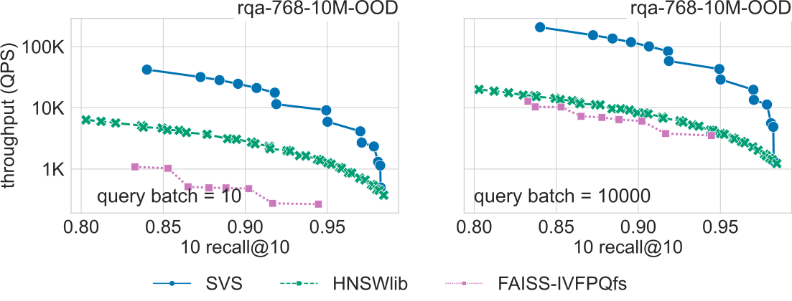
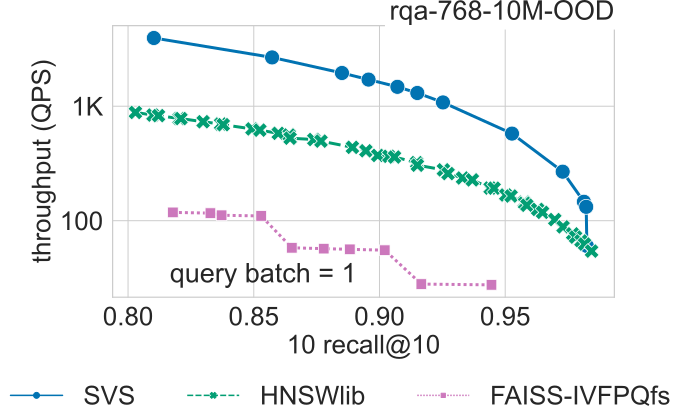

.. _benchs_static_latest:

Latest Results
##############

We compare SVS to the widely adopted implementations HNSWlib [MaYa18]_ and FAISS's IVFPQfs [DGDJ24]_ on various datasets
covering a wide variety of practical scenarios, including different scales (:math:`n=10^6` to :math:`n=10^9`),
dimensionalities (:math:`d=96, 200, 512, 768`), and deep learning modalities (texts,
images, and multimodal). A summary of the experimental setup is presented below.

**Results summary:**

* At **very large scale** (over 10M vectors, up to 768-dimensional), **SVS outperforms its competitors in terms of QPS** by up to

    * **13.5x** for large query batch size (10k),
    * **8.1x** for small query batch size (10),
    * **4.4x** for single query.

* At **million scale**, **SVS outperforms its competitors in terms of QPS** by up to

    * **6.5x** for large query batch size (10k),
    * **9.6x** for small query batch size (10),
    * **4.3x** for single query.

Values reported for a **search accuracy of 0.9 10 recall at 10**.

The table below summarizes the QPS boost with respect to SVS closest competitor for different query batch sizes for a search accuracy of 0.9 10 recall at 10.

+------------------------+-------------------------+------------------------------------------------+-------------------------------------------------+
|                        |                         | **Query batch size = 10**                      | **Query batch size = 10k**                      |
+------------------------+-------------------------+---------------------------+--------------------+----------------------------+--------------------+
|                        |                         |        **SVS QPS**        | **QPS w.r.t. 2nd** |         **SVS QPS**        | **QPS w.r.t. 2nd** |
+------------------------+-------------------------+---------------------------+--------------------+----------------------------+--------------------+
| **Over million scale** |      **deep-96-1B**     |           95931           |        7.0x        |           473771           |        5.6x        |
+------------------------+-------------------------+---------------------------+--------------------+----------------------------+--------------------+
|                        |     **deep-96-100M**    |           140505          |        4.5x        |           728430           |        4.7x        |
+------------------------+-------------------------+---------------------------+--------------------+----------------------------+--------------------+
|                        |     **t2i-200-10M**     |           47148           |        3.2x        |           276725           |        3.8x        |
+------------------------+-------------------------+---------------------------+--------------------+----------------------------+--------------------+
|                        | **open-images-512-13M** |           79507           |        3.3x        |           406301           |        4.9x        |
+------------------------+-------------------------+---------------------------+--------------------+----------------------------+--------------------+
|                        |   **rqa-768-10M-OOD**   |           23296           |        8.1x        |           111263           |        13.5x       |
+------------------------+-------------------------+---------------------------+--------------------+----------------------------+--------------------+
| **Million scale**      |      **deep-96-1M**     |           385542          |        3.4x        |           2504286          |        3.2x        |
+------------------------+-------------------------+---------------------------+--------------------+----------------------------+--------------------+
|                        |      **t2i-200-1M**     |           117024          |        3.1x        |           712564           |        3.7x        |
+------------------------+-------------------------+---------------------------+--------------------+----------------------------+--------------------+
|                        |  **open-images-512-1M** |           121425          |        2.7x        |           675808           |        2.8x        |
+------------------------+-------------------------+---------------------------+--------------------+----------------------------+--------------------+
|                        |    **rqa-768-1M-OOD**   |           50138           |        9.6x        |           240732           |        6.5x        |
+------------------------+-------------------------+---------------------------+--------------------+----------------------------+--------------------+

The figure below shows the QPS vs recall curves for the `rqa-768-10M-OOD <https://github.com/IntelLabs/VectorSearchDatasets/blob/main/rqa/README.md>`_
dataset (10M 768-dimensional embeddings generated with the dense passage retriever model RocketQA [QDLL21]_ with out-of-distribution queries).

|

|

**Click on the triangles** to see the QPS vs recall curves for the other datasets.

.. collapse:: deep-96-1B

    Results for the deep-96-1B dataset

    .. image:: ../../figs/bench_SPR_deep-1B.svg
       :width: 700
       :alt: SVS similarity search results for the deep-96-1B dataset.

.. collapse:: deep-96-100M

    Results for the deep-96-100M dataset

    .. image:: ../../figs/bench_SPR_deep-100M.svg
       :width: 700
       :alt: SVS similarity search results for the deep-96-100M dataset.

.. collapse:: deep-96-1M

    Results for the deep-96-1M dataset

    .. image:: ../../figs/bench_SPR_deep-1M.svg
       :width: 700
       :alt: SVS similarity search results for the deep-96-1M dataset.

.. collapse:: open-images-512-13M

    Results for the open-images-512-13M dataset

    .. image:: ../../figs/bench_SPR_oi-13M.svg
       :width: 700
       :alt: SVS similarity search results for the open-images-13M dataset.

.. collapse:: open-images-512-1M

    Results for the open-images-512-1M dataset

    .. image:: ../../figs/bench_SPR_oi-1M.svg
       :width: 700
       :alt: SVS similarity search results for the open-images-1M dataset.

.. collapse:: rqa-768-1M-OOD

    Results for the rqa-768-1M dataset

    .. image:: ../../figs/bench_SPR_rqa-1M.svg
       :width: 700
       :alt: SVS similarity search results for the rqa-768-1M-OOD dataset.

.. collapse:: t2i-200-10M

    Results for the t2i-200-10M dataset

    .. image:: ../../figs/bench_SPR_text2image-10M.svg
       :width: 700
       :alt: SVS similarity search results for the t2i-200-10M dataset.

.. collapse:: t2i-200-1M

    Results for the t2i-200-1M dataset

    .. image:: ../../figs/bench_SPR_text2image-1M.svg
       :width: 700
       :alt: SVS similarity search results for the t2i-200-1M dataset.

|

Single Query
============

We ran the benchmarking for the single query case (query batch size = 1) for a representative subset of the datasets.
The table below summarizes the QPS boost with respect to SVS closest competitor for a search accuracy of 0.9 10 recall at 10.

+-------------------------+----------------------------------+
|                         |     **Query batch size = 1**     |
+-------------------------+-------------+--------------------+
|                         | **SVS QPS** | **QPS w.r.t. 2nd** |
+-------------------------+-------------+--------------------+
| **deep-96-100M**        | 17561       | 4.3x               |
+-------------------------+-------------+--------------------+
| **open-images-512-13M** | 9757        | 3.2x               |
+-------------------------+-------------+--------------------+
| **rqa-768-10M-OOD**     | 1620        | 4.4x               |
+-------------------------+-------------+--------------------+
| **open-images-512-1M**  | 15370       | 2.6x               |
+-------------------------+-------------+--------------------+
| **rqa-768-1M-OOD**      | 2928        | 4.3x               |
+-------------------------+-------------+--------------------+

The figure below shows the QPS vs recall curves for the `rqa-768-10M-OOD <https://github.com/IntelLabs/VectorSearchDatasets/blob/main/rqa/README.md>`_
dataset (10M 768-dimensional embeddings generated with the dense passage retriever model RocketQA [QDLL21]_ with out-of-distribution queries).

|

|

**Click on the triangles** to see the QPS vs recall curves for the other datasets.

.. collapse:: deep-96-100M

    Results for the deep-96-100M dataset

    .. image:: ../../figs/bench_SPR_singleQuery_deep-100M.svg
       :width: 500
       :alt: SVS similarity search results for the deep-96-100M dataset.

.. collapse:: open-images-512-13M

    Results for the open-images-512-13M dataset

    .. image:: ../../figs/bench_SPR_singleQuery_oi-13M.svg
       :width: 500
       :alt: SVS similarity search results for the open-images-13M dataset.

.. collapse:: open-images-512-1M

    Results for the open-images-512-1M dataset

    .. image:: ../../figs/bench_SPR_singleQuery_oi-1M.svg
       :width: 500
       :alt: SVS similarity search results for the open-images-1M dataset.

.. collapse:: rqa-768-1M-OOD

    Results for the rqa-768-1M dataset

    .. image:: ../../figs/bench_SPR_singleQuery_rqa-1M.svg
       :width: 500
       :alt: SVS similarity search results for the rqa-768-1M-OOD dataset.

|

Datasets
=========
To cover a wide range of use cases, we evaluate SVS on standard datasets of diverse dimensionalities (:math:`d=96`
to :math:`d=768`), number of elements (:math:`n=10^6` to :math:`n=10^9`), and metrics as described in the table below.

+--------------------------------------------------------------------------------------------------------------+-------+-------+--------------+-------------------+---------------+-----------------+
| **Dataset**                                                                                                  | **d** | **n** | **Encoding** | **Similarity**    | **n queries** | **Space (GiB)** |
+--------------------------------------------------------------------------------------------------------------+-------+-------+--------------+-------------------+---------------+-----------------+
| `deep-96-1B    <http://sites.skoltech.ru/compvision/noimi/>`_                                                | 96    | 1B    | float32      | cosine similarity | 10000         | 257.6           |
+--------------------------------------------------------------------------------------------------------------+-------+-------+--------------+-------------------+---------------+-----------------+
| `deep-96-100M    <http://sites.skoltech.ru/compvision/noimi/>`_                                              | 96    | 100M  | float32      | cosine similarity | 10000         | 35.8            |
+--------------------------------------------------------------------------------------------------------------+-------+-------+--------------+-------------------+---------------+-----------------+
| `deep-96-1M    <http://sites.skoltech.ru/compvision/noimi/>`_                                                | 96    | 1M    | float32      | cosine similarity | 10000         | 0.36            |
+--------------------------------------------------------------------------------------------------------------+-------+-------+--------------+-------------------+---------------+-----------------+
| `t2i-200-10M   <https://research.yandex.com/blog/benchmarks-for-billion-scale-similarity-search>`_           | 200   | 10M   | float32      | inner product     | 10000         | 7.5             |
+--------------------------------------------------------------------------------------------------------------+-------+-------+--------------+-------------------+---------------+-----------------+
| `t2i-200-1M   <https://research.yandex.com/blog/benchmarks-for-billion-scale-similarity-search>`_            | 200   | 1M    | float32      | inner product     | 10000         | 0.75            |
+--------------------------------------------------------------------------------------------------------------+-------+-------+--------------+-------------------+---------------+-----------------+
| `open-images-512-13M <https://github.com/IntelLabs/VectorSearchDatasets/blob/main/openimages/README.md>`_    | 512   | 13M   | float32      | cosine similarity | 10000         | 24.8            |
+--------------------------------------------------------------------------------------------------------------+-------+-------+--------------+-------------------+---------------+-----------------+
| `open-images-512-1M <https://github.com/IntelLabs/VectorSearchDatasets/blob/main/openimages/README.md>`_     | 512   | 1M    | float32      | cosine similarity | 10000         | 2.5             |
+--------------------------------------------------------------------------------------------------------------+-------+-------+--------------+-------------------+---------------+-----------------+
| `rqa-768-10M-OOD <https://github.com/IntelLabs/VectorSearchDatasets/blob/main/rqa/README.md>`_               | 768   | 10M   | float32      | inner product     | 10000         | 28.6            |
+--------------------------------------------------------------------------------------------------------------+-------+-------+--------------+-------------------+---------------+-----------------+
| `rqa-768-1M-OOD <https://github.com/IntelLabs/VectorSearchDatasets/blob/main/rqa/README.md>`_                | 768   | 1M    | float32      | inner product     | 10000         | 2.9             |
+--------------------------------------------------------------------------------------------------------------+-------+-------+--------------+-------------------+---------------+-----------------+

.. _benchs_static_latest_system_setup:

System Setup
============
We run our experiments (except dataset deep-96-1B) on a 2-socket 4th generation Intel\ |reg| Xeon\ |reg| Platinum 8480L CPU with
56 cores per socket, equipped with 512GB DDR4 memory per socket @4800MT/s speed,  running Ubuntu 22.04. [#ft1]_ [#ft3]_
For the deep-96-1B, dataset we use a server with the same characteristics except that it is equipped with 1TB DDR4 memory
per socket @4400MT/s speed.

We use ``numactl`` to ran all experiments in a single socket (see :ref:`numa` for details).

We use the ``hugeadm`` Linux utility to :ref:`preallocate a sufficient number of 1GB huge pages <hugepages>` for each algorithm.
SVS explicitly uses huge pages to reduce the virtual memory overheads.
For a fair comparison, we run other methods with system flags enabled to automatically use huge pages for large allocations.
For the deep-96-1B dataset, we were not able to use huge pages for the other methods as this causes an out-of-memory issue.

The large query batch size experiments (batch size = 10k) are run using 112 threads (hyper threading enabled in a single socket), whereas the small query batch size
(batch size = 10) is run using 10 threads. Using fewer threads benefits all methods for the small query batch size case.

Parameters Setting
==================
We run different parameter settings for each method and generate Pareto curves with the best QPS for each recall value.

For **SVS**, we build graphs with: ``graph_max_degree`` = 128 and ``alpha`` = 1.2 or 0.95 if using Euclidean distance
or inner product, respectively.
For **HSNWlib**, we build graphs with ``graph_max_degree`` = 32, 64, 128 (this corresponds
to M=16, 32, 64 in HSNW notation), except for the deep-96-1B dataset for which we use ``graph_max_degree`` = 64 (M=32)
to be able to fit the working set size in 1TB memory.

For **FAISS-IVFPQfs**, we use ``nlist`` = 4096, 8192, 16384 and ``nbins`` :math:`=48` (and ``nbins`` :math:`=96` for ``nlist`` = 8192) for
all datasets except deep-96-1B for which we use ``nlist`` = 32768 and ``nbins`` :math:`=48`. Re-ranking is enabled, and
at runtime we sweep ``nprobe`` :math:`=[1,5,10,50,100,200]` and  ``k for re-ranking`` :math:`= [0,10,100,1000]`.

We used the following versions of each method:
SVS `commit a43c902 <https://github.com/IntelLabs/ScalableVectorSearch/commit/a43c9024cc361f7e9d1cd8d1fb0a6dc0bb3f5f02>`_,
HNSWlib Python version hnswlib-0.8.0, and for FAISS-IVFPQfs faiss-cpu version 1.8.0.

Evaluation Metrics
==================
In all benchmarks and experimental results, search accuracy is measured by k-recall at k, defined by
:math:`| S \cap G_t | / k`, where :math:`S` are the ids of the :math:`k` retrieved neighbors and
:math:`G_t` is the ground-truth. We use :math:`k=10` in all experiments.
Search performance is measured by queries per second (QPS).

.. |copy|   unicode:: U+000A9 .. COPYRIGHT SIGN
.. |reg|   unicode:: U+00AE .. REGISTERED

.. rubric:: Footnotes

.. [#ft1] Performance varies by use, configuration and other factors. Learn more at `www.Intel.com/PerformanceIndex <www.Intel.com/PerformanceIndex/>`_.
       Performance results are based on testing as of dates shown in configurations and may not reflect all publicly
       available updates. No product or component can be absolutely secure. Your costs and results may vary. Intel
       technologies may require enabled hardware, software or service activation. |copy| Intel Corporation.  Intel,
       the Intel logo, and other Intel marks are trademarks of Intel Corporation or its subsidiaries.  Other names and
       brands may be claimed as the property of others.

.. [#ft3] All experimental results were completed by April 1st 2024.