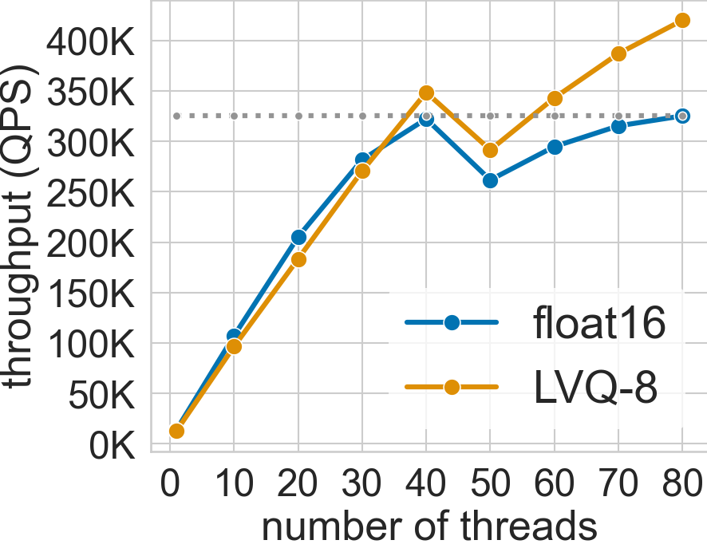
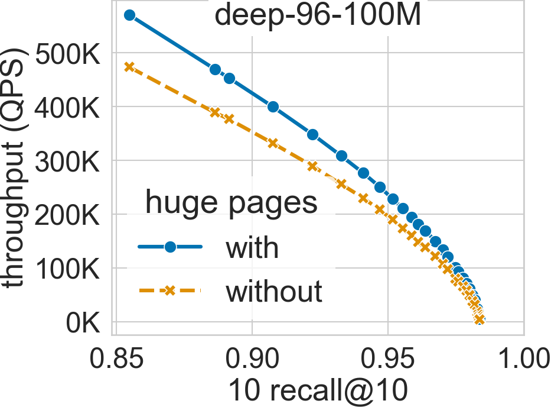
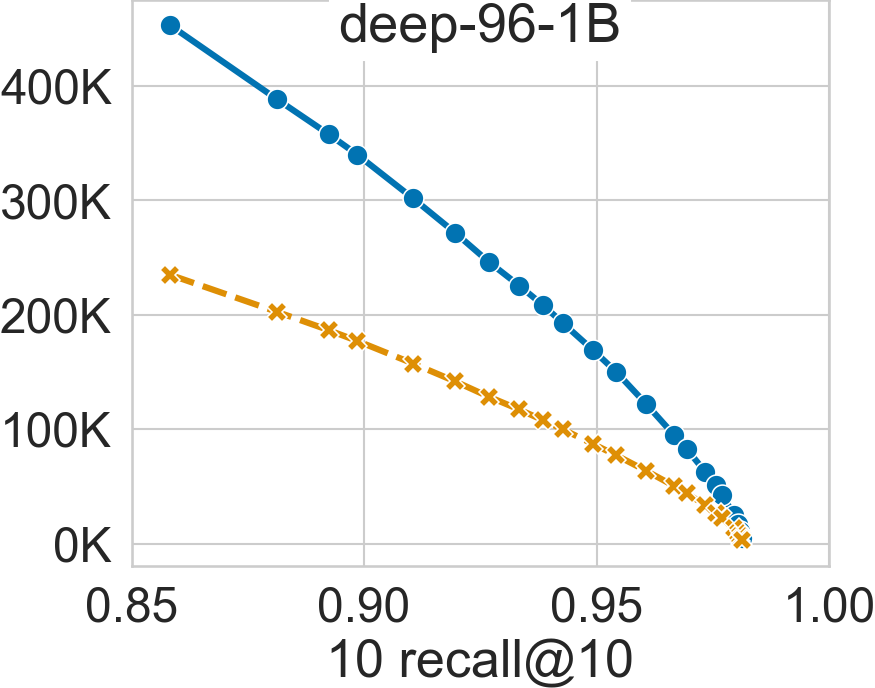

System Utilization
******************

.. contents::
   :local:
   :depth: 1

.. _multithreading_scaling:

Multithreading
==============
SVS can paralellize the search across queries with each thread being responsible for a subset of the query batch,
running a single-thread search routine for each query in the batch.

SVS scales very well with the number of hardware threads used. The figure below shows this for the deep-96-100M dataset
(see :ref:`datasets` for details) with the system configuration described in :ref:`system_setup_large_scale_benchs` [#]_ [ABHT23]_.

The system has 40 cores per socket with 2-way hyper-threading enabled (maximum 80 threads per socket). The QPS increases
up to 40 threads when using both float16 and LVQ-8 compressed vectors.

For float16, the performance scaling slows down between 30 and 40 threads and saturates at 40 threads as the required
memory bandwidth approaches the system peak. On the other hand, LVQ-8 reduces the memory bandwidth pressure and scales
beyond 40 threads reaching its maximum value at 80 threads, fully utilizing the hyper-threading capabilities.

As a result, SVS gains 23.5x and 33x performance over single-thread in float16 and LVQ-8, respectively.

Interestingly, for both data types, the performance drops immediately after 40 threads due to hyperthreading.
The threads sharing a core are slower and cap the overall search performance in batch mode.
However, increasing the threads further leads to higher throughput outweighing the individual thread latency.

.. _huge_pages_usage:

Huge Pages Utilization
======================
SVS explicitly uses :ref:`huge pages <hugepages>` to reduce the virtual memory overheads. By doing so, it can achieve significant
performance gains for large datasets, as shown in the figures below for deep-96-100M and deep-96-1B (see :ref:`datasets` for details)
with the system configuration described in :ref:`system_setup_large_scale_benchs`.

For a search accuracy of 0.9 10 recall at 10, SVS achieves a 20% performance boost in deep-96-100M and 90% in deep-96-1B [ABHT23]_.

.. |copy|   unicode:: U+000A9 .. COPYRIGHT SIGN
.. |reg|   unicode:: U+00AE .. REGISTERED

.. rubric:: Footnotes

.. [#] Performance varies by use, configuration and other factors. Learn more at `www.Intel.com/PerformanceIndex <www.Intel.com/PerformanceIndex/>`_.
       Performance results are based on testing as of dates shown in configurations and may not reflect all publicly
       available updates. No product or component can be absolutely secure. Your costs and results may vary. Intel
       technologies may require enabled hardware, software or service activation. |copy| Intel Corporation.  Intel,
       the Intel logo, and other Intel marks are trademarks of Intel Corporation or its subsidiaries.  Other names and
       brands may be claimed as the property of others.
