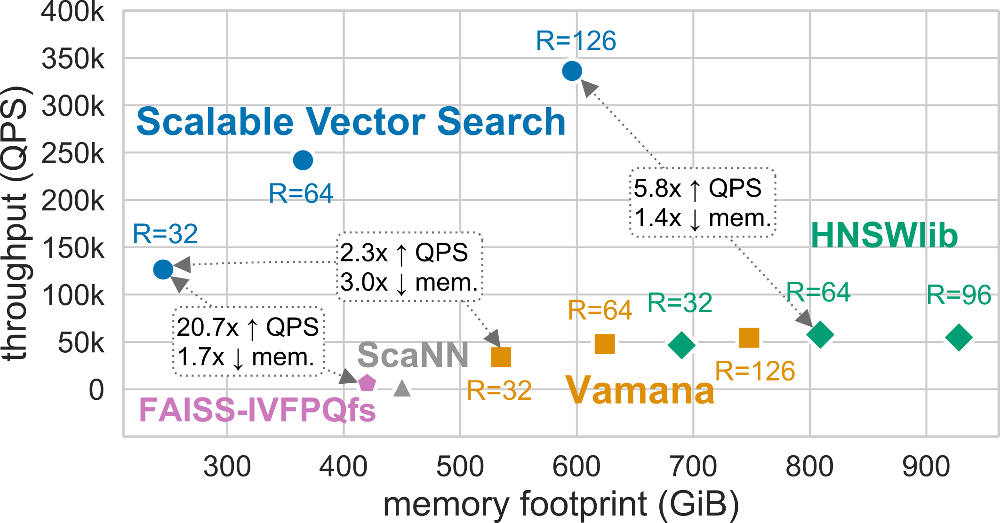

.. _intro:

Introduction
############

.. contents::
   :local:
   :depth: 1

Scalable Vector Search
***********************
**Scalable Vector Search (SVS)** is a performance library for vector `similarity search <https://en.wikipedia.org/wiki/Similarity_search>`_.
Thanks to the use of Locally-adaptive Vector Quantization [ABHT23]_ and its highly optimized indexing and search algorithms,
SVS provides vector similarity search:

* on **billions** of **high-dimensional** vectors,
* at **high accuracy**
* and **state-of-the-art speed**,
* while enabling the use of **less memory** than its alternatives.

This enables application and framework developers using similarity search to unleash its performance on Intel |reg| Xeon CPUs (2nd generation and newer).

SVS offers a fully-featured and yet simple Python API, compatible with most standard libraries.
SVS is written in C++ to facilitate its integration into performance-critical applications.

Performance
============
SVS provides state-of-the-art performance and accuracy [ABHT23]_ for billion-scale similarity search on
:ref:`standard benchmarks <benchs>`.

For example, for the standard billion-scale `Deep-1B <http://sites.skoltech.ru/compvision/noimi/>`_ dataset,
different configurations of SVS yield significantly increased performance (measured in queries per second, QPS) with a
smaller memory footprint (horizontal axis) than the alternatives [#ft1]_:

|

|

SVS is primarily optimized for large-scale similarity search but it still offers :ref:`state-of-the-art performance
at million-scale <small_scale_benchs>`.

Key Features
============
SVS supports:

* Similarity functions: Euclidean distance, inner product, cosine similarity (see :ref:`supported_distance_functions` for an updated list).
* Vectors with individual values encoded as: float32, float16, uint8, int8 (see :ref:`supported_data_types` for an updated list).
* :ref:`Vector compression <vector_compression>` (including Locally-adaptive Vector Quantization [ABHT23]_)
* Optimizations for Intel |reg| Xeon |reg| processors:

    * 2nd generation (Cascade Lake)
    * 3rd generation (Ice Lake)
    * 4th generation (Sapphire Rapids)

See :ref:`roadmap` for upcoming features.

News
====

* Stay tuned for new features!

What SVS is not
==================
SVS does not provide

* support to generate vector embeddings,
* support for vector post-processing,
* `ACID <https://en.wikipedia.org/wiki/ACID>`_ properties to guarantee data validity regardless off errors, power
  failures, etc.

SVS Documentation
==================
This documentation is organized in three main sections:

#. a high-level description of the library, including tutorials to get-started, use advanced features and tune search
   performance,
#. a detailed description of the Python API,
#. a detailed description of the C++ implementation.

What is Similarity Search?
**************************

.. image:: figs/similarity_search.png
   :width: 700
   :alt: Similarity search diagram.

Given a database of high-dimensional feature vectors and a query vector of the same dimension, the objective of similarity
search is to retrieve the database vectors that are most similar to the query, based on some similarity function. In
modern applications, these vectors represent the content of data (images, sounds, text, etc.), extracted and summarized
using deep learning systems such that similar vectors correspond to items that are semantically related.

To be useful in practice, a similarity search solution needs to provide value across different dimensions:

* **Accuracy:** The search results need to be of good quality to be actionable, that is, the retrieved items need to be
  similar to the query.
* **Performance:** The search needs to be fast, often meeting stringent quality-of-service constraints.
* **Scaling:** Databases are quickly becoming larger and larger, both in terms of the number of items they contain and
  in terms of the dimensionality of said items.
* **Cost:** Being deployed in production and datacenter scenarios, the solution needs to minimize the TCO, often
  measured as a combination of capital expenditures and operating expenses.

A natural solution is to linearly scan over each vector in the database, compare it with the query, rank the results in
decreasing order of similarity, and return the most similar ones. However, the sheer volume and richness of data
preclude this approach and make large-scale similarity search an extremely challenging problem that is both compute and
memory-intensive. To achieve acceleration, dedicated solutions are needed, which commonly involve two phases:

* During **indexing**, each element in the database is converted into a high-dimensional vector. Then, an advanced data
  structure, called an index, is set up such that the search can be carried out as efficiently as possible by
  effectively accessing only a small fraction of the database.
* At **search** time, given a query vector, an algorithm sifts through the database using the index. Its results are
  used to take different informed actions, depending on the final application, based on these semantically relevant results.

.. |copy|   unicode:: U+000A9 .. COPYRIGHT SIGN
.. |reg|   unicode:: U+00AE .. REGISTERED

.. rubric:: Footnotes

.. [#ft1] Performance varies by use, configuration and other factors. Learn more at `www.Intel.com/PerformanceIndex <www.Intel.com/PerformanceIndex/>`_.
       Performance results are based on testing as of dates shown in configurations and may not reflect all publicly
       available updates. No product or component can be absolutely secure. Your costs and results may vary. Intel
       technologies may require enabled hardware, software or service activation. |copy| Intel Corporation.  Intel,
       the Intel logo, and other Intel marks are trademarks of Intel Corporation or its subsidiaries.  Other names and
       brands may be claimed as the property of others.